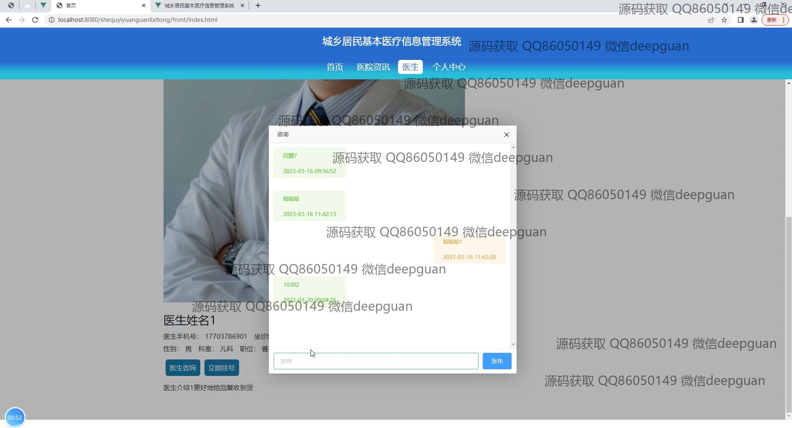

<h1 align="center">基于javaweb的城乡居民基本医疗信息管理系统设计与开发</h1>

## 简介
城乡居民基本医疗信息管理系统：角色分为管理员、用户；功能包括医生管理、医疗信息查询、患者基本信息录入与管理、药品使用管理、在线咨询与医生挂号。系统基于Spring Boot和Java Web开发，简化信息管理流程。    --计算机毕业设计源码；毕设源码；java毕业设计源码

## 联系方式

<h3 align="center">获取完整代码与数据库文件 + 微信：deepguan QQ: 86050149 QQ群: 783742310</h3>

<h3 align="center">可帮忙远程部署 包运行成功！提供远程部署、修改代码、设计文档指导、代码讲解等服务！</h3>

## 功能介绍（完整见运行截图）
管理员：基本功能包括登录、注册和退出。系统设有个人中心，便于管理个人信息和修改密码。可以管理医院、药品分类、医生信息、用户信息等多个模块，通过用户管理界面查看和修改用户详细信息。同时，可以新建、查询和管理病历，处理用户挂号申请和状态更新，提供搜索和查看详情操作。系统支持药品管理，能够登记药品入库信息、使用详情以及调整药品价格和数量，提升医疗资源管理效率。

医生：主要功能包括个人资料管理和医疗信息更新。医生可以通过个人中心输入和修改个人基本信息如姓名、联系方式、身份证号、性别和职称等，还可以上传头像和设定坐诊时间。系统支持新增挂号或取消挂号申请，查看患者状态及详情，提高医生管理挂号情况的便利。医生可与患者进行在线咨询，病历管理页面可记录和查看患者医疗信息及医生建议，增强医患之间的互动与沟通。

患者：基本功能包括登录、注册和退出。用户可以通过个人中心查看与管理个人信息，上传个人照片，修改资料和密码。提供的功能模块包括医生咨询、预约挂号、费用结算和医疗管理。患者可以查看医生信息，进行在线咨询和挂号操作，查询病历，管理自己的医疗记录和下次就诊时间。在药品管理中可以了解药品使用情况，查询药品详细信息，提高对自身健康的管理能力。

## 运行截图

本代码来源于网络,仅供学习参考使用!

